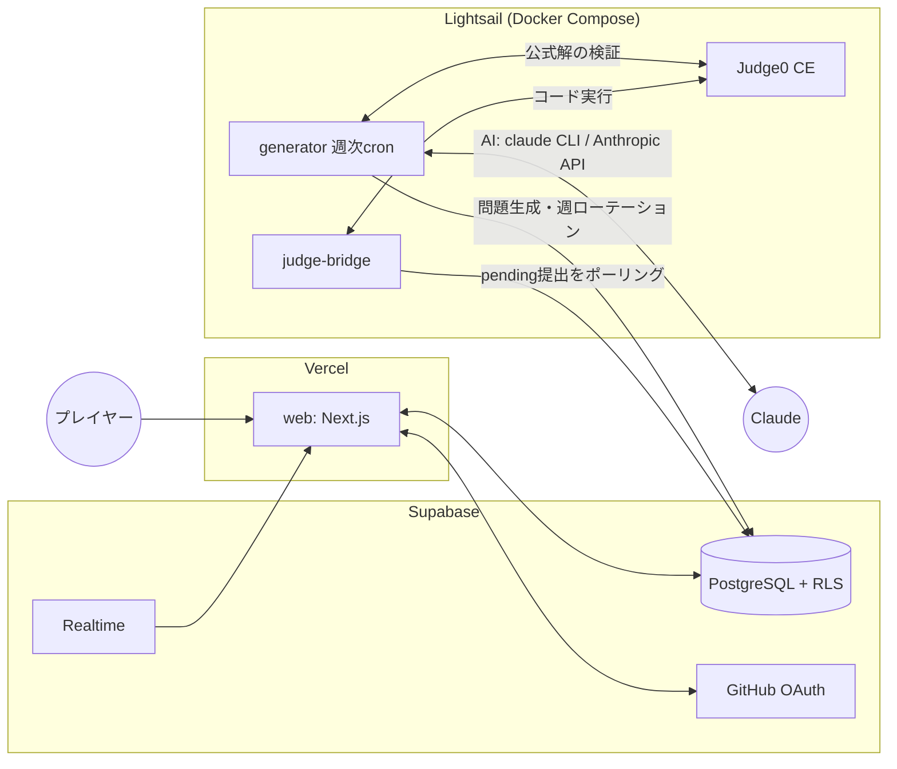

# RaidCoder アーキテクチャ

AtCoder のレイド版。毎週 AI がランク S〜E の問題を生成し、プレイヤー全員の AC がボスへのダメージとして蓄積される非同期協力レイド。週間ダメージでレートを競う。

## デプロイ構成(月額 ¥5,000 以内)

| 場所 | 役割 | コスト |
|---|---|---|
| **Vercel** (Hobby) | `web/` — Next.js アプリ(UI・認証・掲示板) | 無料 |
| **Supabase** (Free) | PostgreSQL / GitHub OAuth / Realtime(ボスHP・提出結果のライブ配信) | 無料 |
| **Lightsail** (4GB, $24/月) | `judge-bridge/` + Judge0(コード実行)+ `generator/` 週次cron | 約¥3,700 |

## トポロジー



## データフロー

### 提出 → ジャッジ
1. `web` が `submissions` に行を insert(status=`pending`、RLS でコード等以外の列は書けない)
2. `judge-bridge` が `claim_pending_submissions()` RPC で原子的にクレーム(status=`running`)
3. テストケース全件を service role で取得し、Judge0 にバッチ提出
4. 結果を集約し `apply_submission_result()` RPC を呼ぶ — ダメージ計算・ボスHP減算・撃破判定・EXP付与まで **DB関数内で原子的に** 行う
5. Supabase Realtime が `submissions` / `raid_weeks` の変更をブラウザへプッシュ → HPバーがライブで減る

### 週次サイクル(毎週月曜 00:00 JST、Lightsail cron)
`generator rotate` が一括実行:
1. `finalize_week()` — 現行週を終了。週間ダメージ順位から perf を算出しレート更新、撃破ボーナスEXP付与
2. AI で次週のボス+問題6問(S〜E)を生成(問題文・テストケース・公式解・解説、すべて日本語)
3. 公式解を Judge0 で全ケース実行し検証。不合格の問題はリトライ(最大3回)
4. 新しい週を `activate_week()` で開始

週が終了(`status='ended'`)すると RLS により解説・公式解・全員の提出コードが自動的に閲覧可能になる。**「回答は1週間後」はこの仕組みで実現。**

### AI プロバイダ切り替え(generator 内)
- `AI_PROVIDER=claude-cli` … ローカル開発用。`claude -p` を子プロセスで起動(setup-token / OAuth 認証をそのまま利用)
- `AI_PROVIDER=anthropic-api` … 本番用。`@anthropic-ai/sdk` + `ANTHROPIC_API_KEY`
- 両者は共通インターフェース `AIProvider.complete(system, user): Promise<string>` の実装として切り替え

## セキュリティ境界
- ブラウザには **anon key のみ**。テストケース(非サンプル)・週終了前の解説・他人のコード(未AC問題)は RLS で遮断
- ダメージ・レートの書き込みは security definer 関数経由のみ(クライアントには execute 権限なし)
- Judge0 は Lightsail 内部ネットワークのみに公開(`X-Auth-Token` 必須)

## リポジトリ構成

```
RaidCoder/
├── web/            Next.js 15 (App Router) — Vercel にデプロイ
├── judge-bridge/   提出ジャッジワーカー (TypeScript, Docker) — Lightsail
├── generator/      AI問題生成・週ローテーション CLI (TypeScript, Docker) — Lightsail cron
├── supabase/       migrations + seed(ローカルは `npx supabase start`)
├── infra/          Lightsail 用 docker-compose、デプロイ手順
└── docs/           ARCHITECTURE.md / CONTRACT.md
```

各モジュールは独立した npm パッケージ(workspace は使わない)。モジュール間の取り決めはすべて [CONTRACT.md](./CONTRACT.md) に定義。
